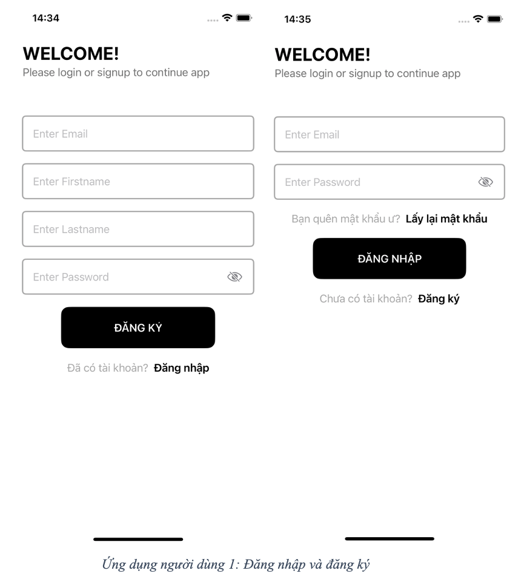
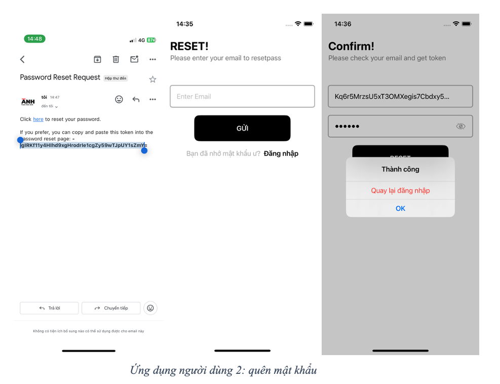
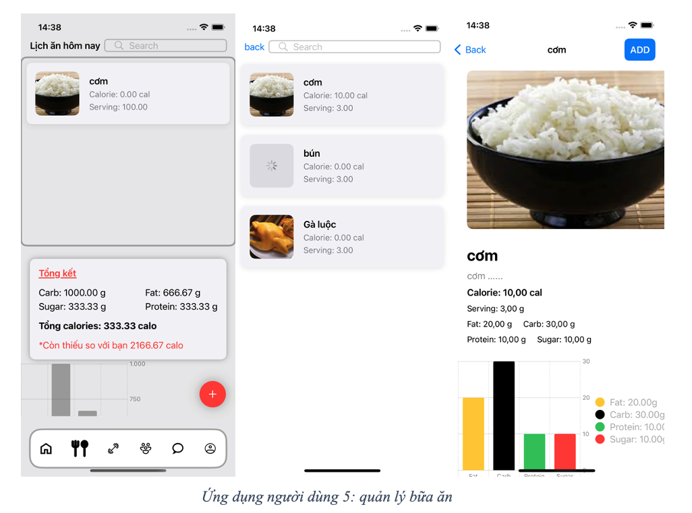
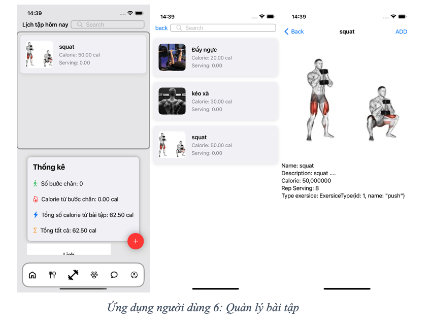
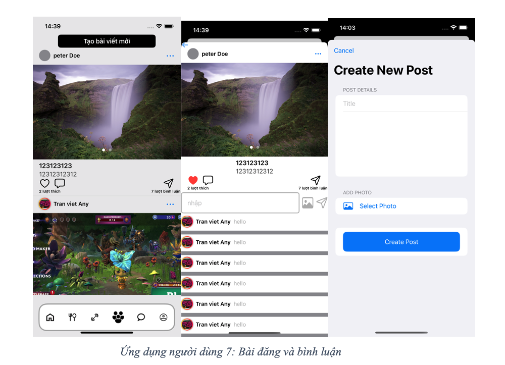
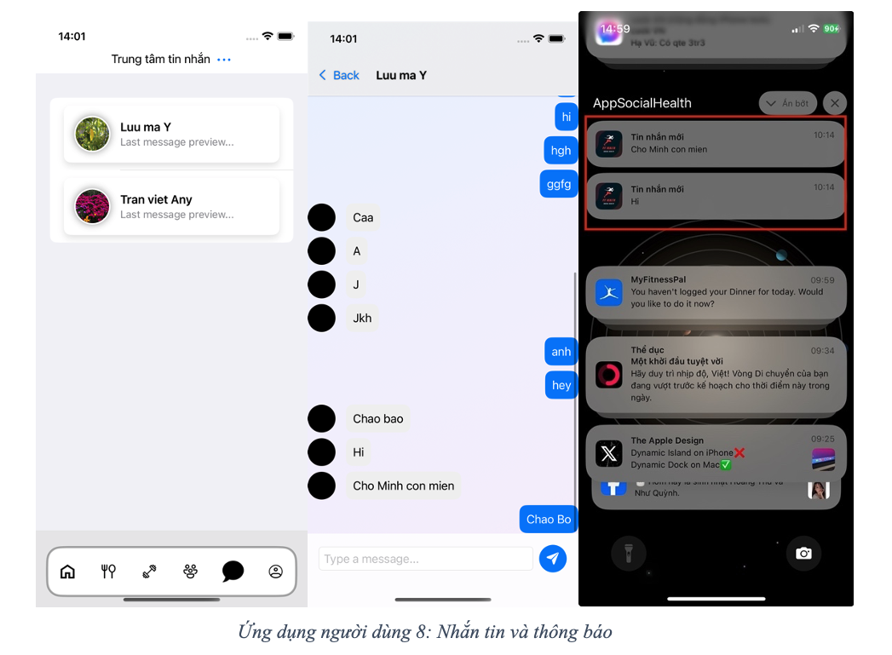
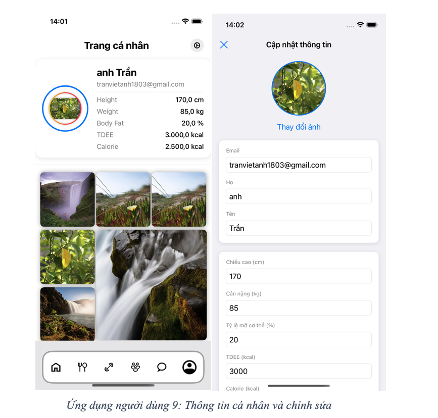
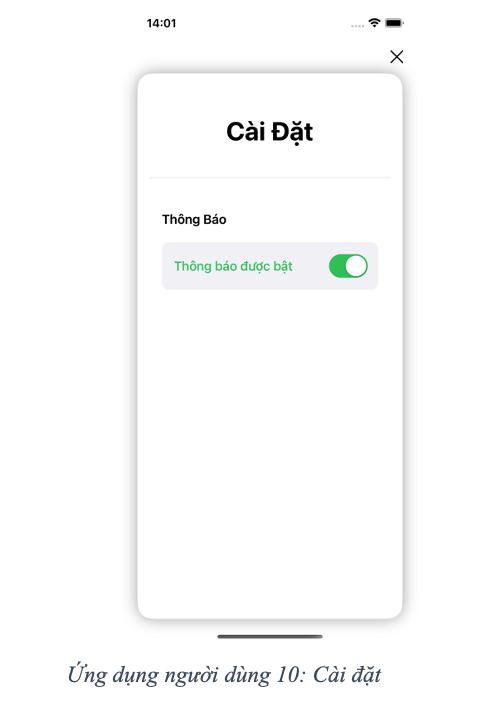

# SocialHealth Admin Desktop Application

## Giới thiệu

SocialHealth Admin Desktop Application là một ứng dụng quản lý cho nền tảng SocialHealth, được phát triển bằng SwiftUI. Ứng dụng này cung cấp các công cụ cần thiết để quản lý người dùng, thức ăn, bài tập và bài viết trên nền tảng SocialHealth.
| AppName                  | Link                                                      |
|--------------------------|-----------------------------------------------------------|
| App desktop social health | https://github.com/henrytran1803/AppDesktopSocialHealth |
| App social health | https://github.com/henrytran1803/AppSocialHealth |
| Back end socialhealth | https://github.com/henrytran1803/BESocialHealth |

## Tính năng

### Các tình năng
- Quản lý tài khoản:
   - Đăng ký tài khoản mới
   - Đăng nhập vào hệ thống
   - Khôi phục mật khẩu khi quên
- Quản lý lịch tập và bài tập:
   - Chọn lịch tập
   - Thêm bài tập mới
   - Chỉnh sửa bài tập đã có
   - Nhắc nhở về lịch tập
- Quản lý bữa ăn:
   - Chọn bữa ăn
   - Thêm bữa ăn mới
   - Chỉnh sửa bữa ăn đã có
- Tương tác với nội dung:
   - Xem bài viết
   - Yêu thích bài viết
   - Bình luận trên bài viết
- Quản lý nội dung cá nhân:
   - Đăng bài viết mới
   - Chỉnh sửa bài viết đã đăng
   - Xoá bài viết đã đăng
- Giao tiếp và nhắn tin:
   - Tạo cuộc trò chuyện mới
   - Nhận tin nhắn
   - Xem tin nhắn
   - Nhắn tin
- Quản lý thông tin cá nhân:
   - Cập nhật thông tin cá nhân

## Cài đặt

### Yêu cầu Hệ thống
- IOS 17.2 trở lên.
- Xcode 15.0 trở lên.
- Swift 5.3 trở lên.

## Sử dụng

## Hình ảnh sản phẩm
### Giao diện Đăng nhập và đăng ký

### Giao diện quên mật khẩu
- mật khẩu khi quên sẽ dược gửi về email một token dùng để reset pass

### Quản lý bữa ăn

### Giao diện bài tập

### Giao diện Quản lý bài đăng

### Giao diện nhắn tin

### Giao diện quản lý trang cá nhân

### Giao diện cài đặt

### resource
tất cả tài liệu báo cáo đều nằm trong phần resource